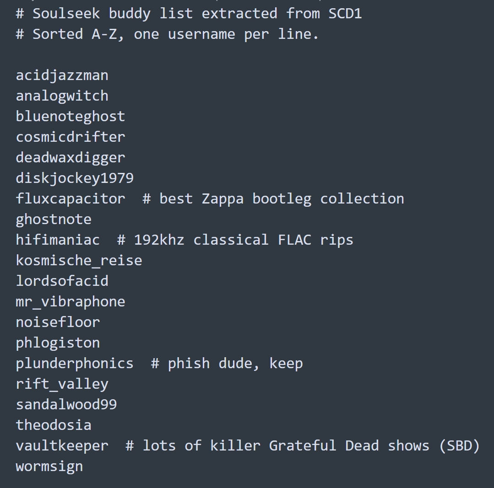
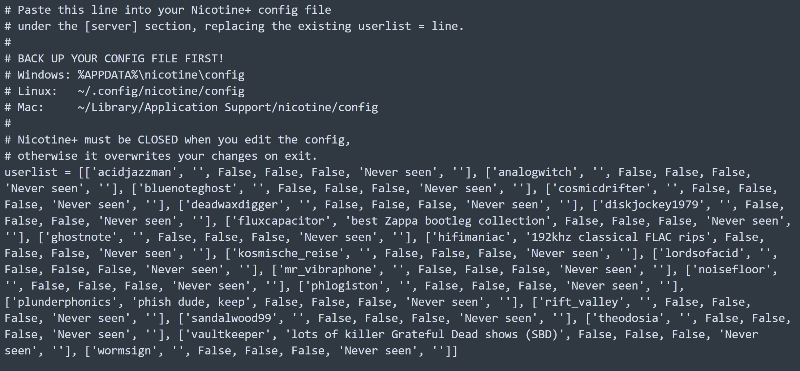
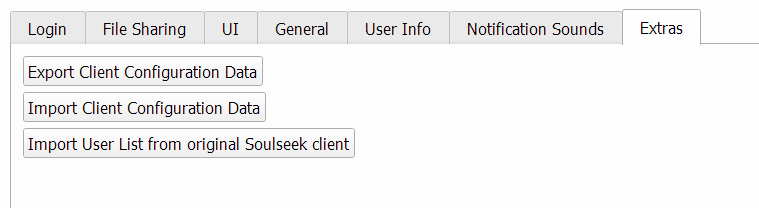

# scd1-to-nicotine

A Python tool to extract your **SoulseekQt** buddy list and user notes from the "proprietary" `.scd1` binary format, and convert them into a plain-text config format so you can import easily into **Nicotine+**.

**Nicotine+** has a lot of features that are not currently available in the official SoulseekQt client, including: 

- Headless mode - `nicotine --headless` runs with no GUI. Useful for servers, NAS boxes, or Raspberry Pi setups that share files 24/7 without a desktop
- Plugin system - extensible via Python plugins. Leech Detector is built in. Community plugins include detailed upload statistics, REST API control, and more

---

## Why Did I Make This?

If you've been on Soulseek for years, you know the deal. Your buddy list isn't just a list. It's a curated map of people you actually care about. A collection of great sharers, good friends, fellow musicians and travelers, people who put you onto music you never would have found, people you've chatted with at 2am about records nobody else cares about. 

Nicotine+ is an open source Soulseek client, and it's actively maintained as well as cross-platform. But switching meant losing your entire buddy list unless you manually copied each user over one by one. That's a lot of friction.

When you decide to move from the **SoulseekQt** client to **Nicotine+**, that list doesn't simply come with you. SoulseekQt stores everything in a closed binary `.scd1` file that is not documented to my knowledge. **Nicotine+** stores this same data in a clean, human-readable plain text config file. There's no official migration path.

This tool attempts to help bridge that gap.

_(Curious about the `.scd1` format? See [A note on the `.scd1` format](#a-note-on-the-scd1-format) below.)_

---

## What it does

- Reads your `.scd1` file (SoulseekQt's data file)
- Extracts your complete buddy list with usernames
- Extracts any user notes you wrote
- Outputs a `buddies.txt` (one username per line, with notes as comments)
- Outputs a ready-to-paste `nicotine_userlist.txt` — a properly formatted `userlist = [...]` line you can drop straight into your Nicotine+ config
- Optionally merges with your _existing_ Nicotine+ buddy list, preserving all your existing notes, flags, last-seen dates, and country data

---

## Example Output

**buddies.txt** - plain sorted list with inline notes



**nicotine_userlist.txt** - ready to paste into your Nicotine+ config



---

## Usage

**Basic extraction:**
```bash
python scd1_to_nicotine.py your_soulseek_data_file.scd1
```

**Merge with your existing Nicotine+ config (auto-detects location):**
```bash
python scd1_to_nicotine.py your_soulseek_data_file.scd1 --merge
```

**Merge with a specific config file:**
```bash
python scd1_to_nicotine.py your_soulseek_data_file.scd1 --merge --config "/path/to/nicotine/config"
```

**Custom output directory:**
```bash
python scd1_to_nicotine.py your_soulseek_data_file.scd1 --output-dir my_output/
```

Output files land in `scd1_extracted/` by default:

| File | Description |
|---|---|
| `buddies.txt` | Plain sorted list, one username per line, notes as comments |
| `nicotine_userlist.txt` | Ready-to-paste `userlist =` line for Nicotine+ config |

---

## How to import into Nicotine+

1. **Close Nicotine+ completely** (check the system tray)
2. **Back up your config file first**
   - Windows: `%APPDATA%\nicotine\config`
   - Linux: `~/.config/nicotine/config`
   - Mac: `~/Library/Application Support/nicotine/config`
3. Open your config in a text editor
4. Find the `[server]` section
5. Replace the existing `userlist = [...]` line with the contents of `nicotine_userlist.txt`
6. Save and reopen Nicotine+

---

## Finding your `.scd1` file



SoulseekQt's `.scd1` data file is typically located here after you export:

- **Windows:** `%APPDATA%\SoulseekQt\`
- **Linux:** `~/.SoulseekQt/`
- **Mac:** `~/Library/Application Support/SoulseekQt/`

The filename will be whatever you named it when you exported from SoulseekQt.

---

## Merge behavior

When using `--merge`, existing Nicotine+ buddy entries are **always preserved exactly as-is** — your notes, notify flags, last-seen dates, country flags, all of it. Only users not already present in your Nicotine+ list are added. Deduplication is case-insensitive.

---

## Known issues

**Windows `PermissionError` on `--merge`:** I've discovered that some users may hit a `PermissionError` reading the Nicotine+ config on Windows even with Nicotine+ apparently fully closed. Cause is unclear. Possibly a background Python process, antivirus file locking, or Windows being Windows. If this happens to you, the workaround is:

```bash
copy "%APPDATA%\nicotine\config" "%USERPROFILE%\Desktop\nicotine_config_backup"
python scd1_to_nicotine.py your_soulseek_data_file.scd1 --merge --config "%USERPROFILE%\Desktop\nicotine_config_backup"
```

If you figure out the root cause of this error, please feel free to open an issue and let me know. Would love to get to the bottom of it. I've only seen this error myself two times so far but I'm curious what the cause could be. Thanks!

---

## Requirements

- Python 3.8+
- No external dependencies, standard library only
- Tested with Nicotine+ 3.3.10 on Windows 11

---

## A note on the `.scd1` format

The `.scd1` format is entirely undocumented and closed. It's a serialized binary object graph which essentially is SoulseekQt's internal data structures written straight to disk, sequential index bytes and all. There's no spec, no reference implementation, nothing.

This tool was built by reverse engineering the raw bytes: hex dumps, offset arithmetic, pointer tables, etc. 

It works correctly for the format as observed, but your mileage may vary if your file has unusual data. If something goes wrong, open an issue and attach the relevant output.

---

## License

MIT. Do what you want with it. Share freely. 

<br>
<br>

_Strangers helping strangers._

